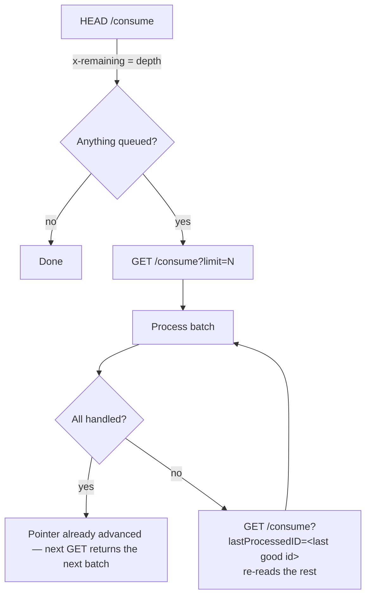

# Ethos Change Notifications (`/consume`)

## Overview

Ethos Integration includes a message broker. Each Ethos application has a **subscription
queue**; when a subscribed resource changes in the SIS, Ethos publishes a
*change-notification* onto that queue. `GET /consume` reads notifications off the queue.

This is the **inbound** direction — the SIS telling MyCE what changed — and it is the mirror
image of what `ethos/library/registration.py` already does outbound (MyCE pushing
registrations into Colleague via `mirror_registration`). Nothing in this repo consumed the
queue before; the `ethos-sis consume` CLI command (see below) is the first piece.

This document records what was verified against the **CTC** tenant on 2026-08-15, so the
consumption pipeline can be designed in the `ewu` repo without re-deriving it.

## The endpoint

```
GET  https://integrate.elluciancloud.com/consume[?lastProcessedID=<n>][&limit=<n>]
HEAD https://integrate.elluciancloud.com/consume
Authorization: Bearer <JWT>
Accept: application/vnd.hedtech.change-notifications.v2+json
```

The JWT is the ordinary `/auth` token; the API key behind it selects **which application's
queue** is read. Subscriptions (which resources land in the queue) are configured in the
Ethos admin UI, not over the API. Regional bases swap the TLD: `.com` (US), `.ca`, `.ie`,
`.com.au`.

| Parameter | Meaning |
|-----------|---------|
| `limit` | Max notifications per call, integer 1–1000. The response is also capped at 1 MB, so fewer may come back than requested even with more queued. |
| `lastProcessedID` | Return notifications published *after* this notification `id`. Used for replay when processing failed partway through a batch. |
| `x-remaining` (response header) | Notifications still queued after this batch. |

### Drain semantics — verified, and sharper than the SDK docs



Observed behaviour on CTC:

1. `HEAD /consume` reported **27** waiting.
2. `GET /consume?limit=1&lastProcessedID=0` returned notification `id=1`. Repeating the
   identical call returned `id=1` **again** — so a read by ID is replayable, not one-shot.
3. `GET /consume?limit=100&lastProcessedID=0` returned all 27, and `HEAD` then reported
   **0**.

So: the application's queue pointer **does** advance to the highest ID returned, even when
`lastProcessedID` is supplied. `lastProcessedID` does not prevent the advance — it lets you
re-read anything still inside Ethos' retention window. Nothing is lost, but "peek without
side effects" is `HEAD` only. Design the poller so a crash mid-batch is recoverable by
replaying from the last ID committed to the DB, and **never** treat a successful `GET` as
"these are still queued for someone else".

All 27 notifications captured during this investigation are preserved verbatim at
[`samples/ctc-section-registration-notifications.json`](samples/ctc-section-registration-notifications.json).

## Notification envelope

Fields marked optional were absent on some CTC messages — do not assume them.

| Field | Type | Notes |
|-------|------|-------|
| `id` | string | Queue sequence number as a string (`"1"` … `"27"`). This is what `lastProcessedID` takes. Not a GUID. |
| `published` | string | UTC timestamp. Note the format is `2026-08-12 20:48:04.702495+00` — space-separated, **not** ISO-8601 `T`. Needs tolerant parsing. |
| `operation` | string | `created` or `replaced` observed. Ethos also defines `deleted`. |
| `resource.name` | string | Resource type, e.g. `section-registrations`. The dispatch key. |
| `resource.id` | string (GUID) | The changed record's GUID. Always equalled `content.id` across all 27. |
| `resource.version` | string | Holds the **media type**, e.g. `application/vnd.hedtech.integration.v16.2.0+json` — not a bare `v16`. |
| `contentType` | string | `resource-representation` on all 27. |
| `messageType` | string | `change-notification` on all 27. |
| `publisher.id` | string (GUID) | Publishing application. One publisher across all 27. |
| `content` | object | Full resource body — no follow-up GET needed. |
| `messageId` | string | **Optional** (14 of 27). SIS-side message number, e.g. `"5704543"`. Not correlated with `operation`. |
| `initiated` | string | **Optional** (14 of 27, same messages as `messageId`). ISO-8601 UTC, the SIS-side event time. Ran as far back as `2026-07-27`, i.e. well before `published` — the queue can carry events much older than their publish time. |

## `section-registrations` content

Every one of the 27 CTC notifications was `resource.name = section-registrations`, media type
`v16.2.0`. Content shape (all fields present on all 27):

```json
{
  "id": "f8322049-68b4-4f8d-b76c-147b265df056",
  "registrant": { "id": "31573bd7-c0a2-4007-8cbd-e5d9434b94c2" },
  "section":    { "id": "f807272a-40e3-49f1-9f1a-e0022160c76a" },
  "academicLevel": { "id": "726aee41-d9b0-49ca-b0bd-17f758fb88b1" },
  "originallyRegisteredOn": "2026-08-04",
  "statusDate": "2026-08-05",
  "status": {
    "registrationStatus": "notRegistered",
    "sectionRegistrationStatusReason": "dropped",
    "detail": { "id": "4ab49b78-1554-49cd-8abc-f6d0f1cbdca9" }
  },
  "approvals": [ { "approvalType": "all", "approvalEntity": "system" } ],
  "credit": { "measure": "credit", "registrationCredit": 3 },
  "gradingOption": { "gradeScheme": { "id": "c8a2..." }, "mode": "standard" },
  "involvement": { "startOn": "2026-08-17T05:00:00Z", "endOn": "2026-11-06T06:00:00Z" }
}
```

### Status/operation combinations observed

| Count | `operation` | `registrationStatus` | `sectionRegistrationStatusReason` | Reading |
|-------|-------------|----------------------|-----------------------------------|---------|
| 13 | `replaced` | `notRegistered` | `dropped` | Existing registration dropped in the SIS |
| 9 | `created` | `registered` | `registered` | New registration created in the SIS |
| 4 | `created` | `notRegistered` | `dropped` | Created *already* dropped — a create/drop that never surfaced as a separate create |
| 1 | `replaced` | `registered` | `registered` | Re-registered / status refreshed |

Two consequences for handler design: `operation` alone is **not** the action — a `created`
can be a drop — so branch on `status`, and treat `operation` as metadata. And the 4th row
means a `created`+`dropped` may arrive with no prior local record at all.

Two status detail GUIDs appeared, matching the two reasons: `dropped` →
`4ab49b78-1554-49cd-8abc-f6d0f1cbdca9` (17), `registered` →
`56029862-2c12-40f4-843e-649c15e31a46` (10). These are CTC-specific and belong in
`sis_settings` alongside the existing `section_registration_statuses` config that
`RegistrationMixin._status_detail_id` already reads.

Volume across the 27: 4 distinct registrants, 13 distinct sections, spanning
2026-08-12 → 2026-08-14.

## Mapping to the MyCE side

The join keys are GUIDs the MyCE DB already stores, so no lookup table is needed:

| Notification field | MyCE counterpart |
|--------------------|------------------|
| `content.id` | `StudentRegistration.sis_id` (`UUIDField`) — set by `mirror_registration` on a successful create (`log.response_json['id']`) |
| `content.registrant.id` | `Student.sis_id` (`UUIDField`, `cis/models/student.py:142`) |
| `content.section.id` | `ClassSection.external_sis_id`, exposed as the `ClassSection.sis_id` property (`cis/models/section.py:294`) |
| `content.status.sectionRegistrationStatusReason` | `StudentRegistration.status` (`registered` / `dropped`) |
| `content.statusDate` | drives `StudentRegistration.status_changed_on` |

`StudentRegistration` already carries the outbound mirroring bookkeeping — `needs_mirroring`,
`mirror_logs` (M2M to `ethos.EthosLog`), `last_mirror_status`, `last_mirror_error`,
`last_mirror_at`, and a `FieldTracker` on `status`. It lives in `cis/models/section.py`
(class at line 1480 in the `ewu` checkout), **not** in a `registration.py`.

The loop-avoidance problem is the one to solve first: MyCE writes a registration to Ethos,
Ethos publishes a change-notification back, and a naive handler re-applies it locally and
may re-trigger `needs_mirroring`. Options worth weighing — compare `content.id` against a
recently-written `sis_id`, compare `statusDate`/`initiated` against `last_mirror_at`, or
suppress the `FieldTracker`-driven mirror while applying an inbound notification.

Note that `StudentRegistration.status` carries MyCE workflow states that have no SIS
counterpart (`applied`, `approved_by_instructor`, `not_approved_by_instructor`, …), so an
inbound `registered`/`dropped` is not a straight assignment — the handler needs an explicit
mapping and a rule for what to do when the local record is mid-workflow.

## What exists in this repo today

`ethos_sis` (the Django-free CLI) gained `/consume` support:

```bash
ethos-sis consume --peek                          # HEAD — queue depth, no side effects
ethos-sis consume --limit 50                      # read a batch (advances the pointer)
ethos-sis consume --limit 100 --last-processed-id 0 --json > out.json   # replay
```

Nothing in the Django app (`ethos/`) consumes the queue yet. There is no notification model,
no poller task, and no handler dispatch — that is the work to be designed. The pieces it
should resemble: `EthosLog` for the persistence shape, `tasks.py` for the `django-tasks`
worker pattern, and the `library/` mixin composition for per-resource handlers.

## Key Files

| File | Purpose |
|------|---------|
| `ethos_sis/client.py` | `consume_messages()` / `available_message_count()` — raw `/consume` access |
| `ethos_sis/commands/consume.py` | `ethos-sis consume` CLI command |
| `ethos/library/registration.py` | Outbound mirroring — the actions these notifications reflect back |
| `ethos/models.py` | `EthosLog` — the persistence pattern to follow for stored notifications |
| `ethos/tasks.py` | `django-tasks` `@task` pattern for the poller |
| `docs/samples/ctc-section-registration-notifications.json` | All 27 CTC notifications, verbatim |

## Troubleshooting

| Issue | Cause | Resolution |
|-------|-------|------------|
| `--peek` returns 0 but changes are happening in the SIS | Something already drained the queue, or the application isn't subscribed to that resource | Replay with `--last-processed-id 0`; check the app's subscriptions in the Ethos admin UI |
| A batch was read but processing crashed | The pointer advanced on the successful `GET` | Re-read with `--last-processed-id <last id committed to the DB>` |
| Replay returns nothing for old IDs | Ethos retention window has passed | Nothing to recover from the queue; fall back to a resource GET by GUID |
| `PermissionError` on `/consume` | API key's application has no subscription queue | Verify the key and its Ethos application configuration |
