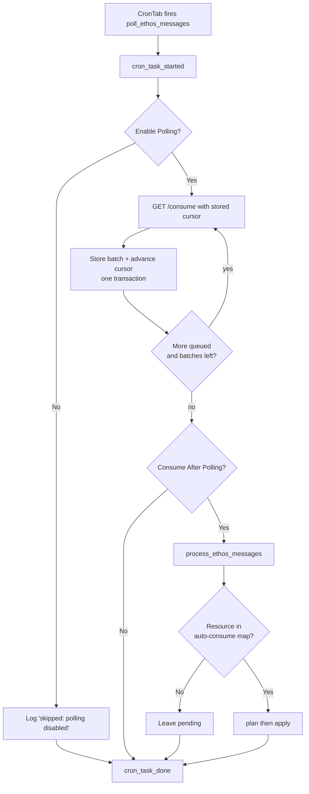
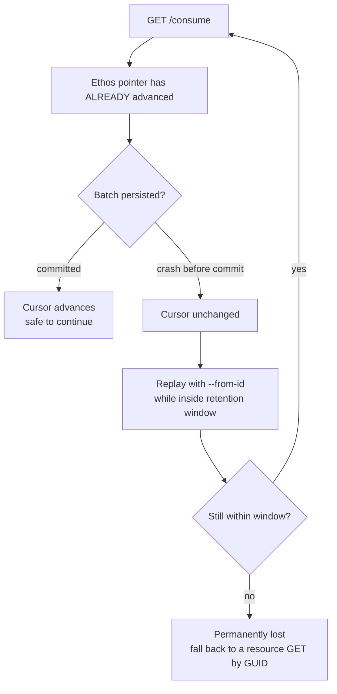

# Polling Ethos Change Notifications

## Overview

Ethos publishes SIS changes — a registration dropped in Banner, a record replaced —
onto a per-application queue, read with `GET /consume`. This package drains that queue
on a schedule, stores every notification, and (optionally) dispatches each one to a
handler that mirrors the change onto local records.

Capture and consumption are deliberately separate. **Polling never consumes, and
consuming never talks to Ethos.** Storing a notification is safe and reversible;
acting on one changes student records, so it is opt-in twice over.

Everything ships **off**. Installing the release seeds the setting and the cron row
but leaves `Enable Polling = No`, so nothing reaches Ethos until someone turns it on.

For the wire-level contract — endpoint, envelope fields, and the verified drain
semantics — see [`ethos-change-notifications.md`](ethos-change-notifications.md).

## What one scheduled run does



Every notification lands as `pending`. A run that stores 40 messages and consumes none
is the normal, expected outcome until a handler is registered *and* its resource is
opted into the auto-consume map.

## The one thing to understand before enabling

**A successful `GET /consume` always advances Ethos's queue pointer.** `lastProcessedID`
only replays notifications still inside Ethos's retention window — it does not hold the
pointer back. `HEAD /consume` is the only side-effect-free way to look.

So a notification that is read but not stored is gone once that window passes. Two
design consequences you will see in the code and in operations:



1. Each batch is stored **and** the cursor advanced inside one transaction. A crash
   before commit replays cleanly from an unmoved cursor.
2. Failures are loud. A 200 response whose body will not parse raises rather than
   returning "nothing" — an empty result is indistinguishable from an empty queue,
   and silently reporting success while notifications were lost is the worst
   available outcome.

## Turning it on

Configured at **Settings → Ethos Change Notifications**.

| Field | Default | Meaning |
|---|---|---|
| Enable Polling | `No` | Master switch. While `No` a scheduled run exits immediately without calling Ethos. |
| Notifications per Request | `100` | Per `/consume` call, 1–1000. Ethos also caps the response at 1 MB, so fewer may return than requested even with more queued. |
| Batches per Run | `1` | Requests per run. Request size × batches is the ceiling one run can read. |
| Consume After Polling | `No` | When `Yes`, a run also dispatches what it stored. Each resource must **also** be in the auto-consume map, so this alone changes nothing. |
| Cron Expression | `0 * * * *` | Saving upserts the `CronTab` row for `poll_ethos_messages`. |

Verify against the real queue before flipping the switch. Both of these work while
polling is off:

```bash
# Is the subscription wired? HEAD only — never advances the pointer.
python manage.py poll_ethos_messages --peek

# One small real batch, without enabling the schedule.
python manage.py poll_ethos_messages --force --limit 5
```

Then open `/ce/ethos/messages/` and check the extracted columns against the raw payload
on the detail page. That is the real test of whether the adapter matches this tenant's
feed — the fixtures were captured from a different tenant.

## Commands

| Command | Purpose |
|---|---|
| `poll_ethos_messages` | Drain the queue into `EthosMessage` rows. The command the cron runs. |
| `process_ethos_messages` | Dispatch stored messages to handlers. |
| `purge_ethos_messages` | Delete stored notifications past the retention window. |
| `purge_ethos_logs` | Delete `EthosLog` rows past their retention window. |

### `poll_ethos_messages` flags

| Flag | Effect |
|---|---|
| `--peek` | `HEAD /consume`; prints queue depth. No side effects, works while disabled, writes no CronLog entry. |
| `--force` | Run even when polling is switched off. For manual verification. |
| `--limit N` | Override notifications per request for this run. |
| `--max-batches N` | Override requests per run. |
| `--from-id N` | Replay from an explicit queue id, ignoring the stored cursor. Recovery tool. |
| `-t`, `--time` | Supplied by `cron_jobs`; triggers the CronLog signals. |

### `process_ethos_messages` flags

| Flag | Effect |
|---|---|
| `--dry-run` | Print what each message *would* do. Writes nothing. |
| `--id N` | Process one message by primary key, regardless of auto-consume. |
| `--resource NAME` | Restrict to one resource type. |
| `--force` | Ignore the auto-consume map and re-run messages that are not pending. |
| `--limit N` | Cap how many messages this run processes. |

## Configuration lives in two tiers

**Operator-tunable** — the five fields above, in the `ethos.settings.ethos_consume`
Setting, editable from the web UI.

**Deployment-level** — read from Django settings, fed by `SECRETS`:

| Key | Default | Purpose |
|---|---|---|
| `ETHOS_CONSUME_RETENTION_DAYS` | `30` | Retention for stored notifications. |
| `ETHOS_LOG_RETENTION_DAYS` | `90` | Retention for `EthosLog`. |
| `ETHOS_CONSUME_AUTO` | `{}` | Per-resource opt-in for unattended consumption. |
| `ETHOS_CONSUME_HANDLERS` | `{}` | `{resource_name: 'dotted.path.To.Handler'}`. |

The split is deliberate: retention governs data destruction, and the auto-consume map
plus handler registry decide what mutates student records. Neither belongs behind a web
form a CE admin can edit.

`consume/config.py` is the seam. The Setting wins when it holds a usable value; an
out-of-range or non-numeric value counts as *unconfigured* and falls through to the
Django-settings key, so a bad form entry degrades to the default rather than breaking
the poller.

## Message lifecycle

| Status | Meaning |
|---|---|
| `pending` | Stored, not yet dispatched. The poller only ever writes this. |
| `consumed` | A handler applied it. `action` and `action_detail` say what happened. |
| `failed` | A handler raised. `error` holds the traceback. **Never retried automatically** — re-run by hand from the detail page or with `--id`. |
| `skipped` | No handler configured for that resource type. |
| `flagged` | A handler declined — e.g. an inbound record with no local counterpart. No writes were made. |

Each message carries a **single** result, overwritten on re-run, not an attempt history.
Retention deletes the message and its result together, so anything needed long-term must
be recorded by the handler (a note on the affected record), not left here.

A message `skipped` for "no handler" stays `skipped` after a handler is later configured
— use `--force` or the UI button to re-run it.

## Scheduled runs in CronLog

When invoked with `--time` (as `cron_jobs` does), the command emits `cron_task_started`
and `cron_task_done`, so every scheduled run appears in CronLog with a summary and a JSON
detail blob.

Two behaviours worth knowing:

- A **disabled** run still emits `cron_task_done`, recording "skipped: polling disabled".
  A silent no-op would look identical to a broken cron.
- A **failed** run emits `cron_task_done` with the error *before* re-raising. Ethos's
  pointer may already have advanced past notifications the run failed to store, so that
  entry is part of the audit trail for what was lost.

Manual runs and `--peek` emit nothing, so they leave no CronLog noise.

## Key Files

| File | Purpose |
|------|---------|
| `ethos/settings/ethos_consume.py` | The operator setting; upserts the `CronTab` row |
| `ethos/consume/config.py` | Two-tier config seam (Setting over Django settings) |
| `ethos/consume/poller.py` | `poll()` — the drain loop, persist-then-advance |
| `ethos/consume/adapter.py` | `parse_notification()` — the only code that knows Ethos field names |
| `ethos/consume/base.py` | `ConsumeHandler` protocol; `Plan` / `Change` / `Result` |
| `ethos/consume/registry.py` | `get_handler()` — dotted-path resolution from settings |
| `ethos/consume/service.py` | `consume_message()` — plan/apply dispatch and result recording |
| `ethos/management/commands/poll_ethos_messages.py` | The scheduled command; gate + CronLog signals |
| `ethos/models.py` | `EthosMessage`, `EthosConsumeCursor` |
| `ethos/views/messages.py` | CE browsing, dry-run, and consume actions |
| `docs/ethos-change-notifications.md` | The verified wire-level contract |
| `docs/samples/` | 27 real notifications, used as the test fixture |

## Troubleshooting

| Issue | Cause | Resolution |
|-------|-------|------------|
| Cron runs but nothing is stored | `Enable Polling` is `No` | Check CronLog — a disabled run records "skipped: polling disabled". Enable it in Settings. |
| `--peek` reports 0 while changes are happening in the SIS | Something already drained the queue, or the application is not subscribed to that resource | Replay with `--from-id 0`; check the app's subscriptions in the Ethos admin UI. |
| `--peek` raises instead of printing a count | Non-OK response from Ethos — usually bad credentials | Check `COLLEAGUE_AUTH_CODE`. Peek deliberately raises rather than reporting a reassuring 0. |
| A run failed partway | Ethos's pointer advanced past the batch | Re-run with `--from-id <last id committed>`. Read it from the cursor or the highest stored `queue_id`. |
| Replay returns nothing for old ids | Ethos's retention window has passed | Not recoverable from the queue; fall back to a resource `GET` by GUID. |
| Messages pile up as `pending` | No handler registered, or the resource is not in the auto-consume map | Expected before a handler exists. Otherwise add the dotted path to `ETHOS_CONSUME_HANDLERS` and opt the resource into `ETHOS_CONSUME_AUTO`. |
| Messages land as `skipped` | No handler for that resource type | Register one, then re-run with `--force` — `skipped` messages are not picked up automatically. |
| A message is `failed` | The handler raised | Open it at `/ce/ethos/messages/`, read `error`, fix the handler, then re-run that message. Failures are never retried automatically. |
| Dry-run shows an error instead of a plan | The handler's `plan()` raised | The error is rendered in the panel rather than 500ing. Fix the handler; nothing was written. |
| Duplicate `CronTab` rows for polling | Should not happen — the setting upserts | Saving the setting moves the existing row. If duplicates exist, delete the extras; only one is created going forward. |
